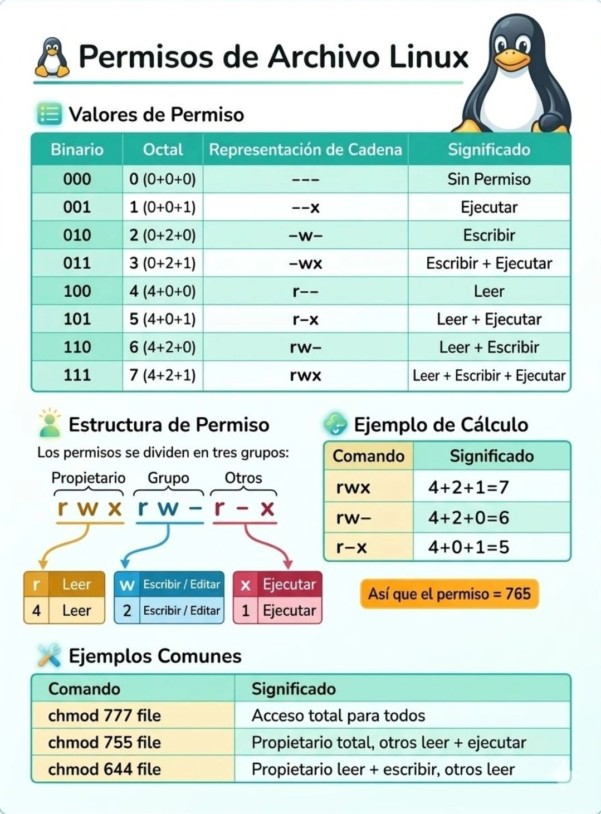

 # $${\color{darkblue}Listado \space Comandos  \space Básicos \space Linux \space para \space ISO / SSII}$$

# Comandos para Ubicación y Contenido

**pwd** &rarr; Mostrar dónde estoy situado.

    Para saber donde estoy, y por lo tanto, para no perderme dentro del terminal de Linux...

**ls**  &rarr;  Mostar archivos y carpetas.

    Es importante saber, que hay que mirar antes de hacer algo...

### Comandos para Moverse entre carpetas

**cd** &rarr; ChangeDirectory. Moverse entre carpetas

    cd Documents      Estoy dentro de una carpeta

    cd ..             Volver hacia atrás

    cd ~              Voy a mi carpeta personal.

**Importante: Si no etoy bien situado, todo puede fallar...**

### Comandos para archivos

**touch** &rarr; Sirve para crear un archivo vacío.

**nano** &rarr; Editar archivo.

      Ctrl + O --> Guardar Documento

      Ctrl + X --> Salir del Documento

### Comando para Ver Contenido

**cat** &rarr; Muestra lo que hay dentro de un archivo.

        Si uso solo cat, se queda esperando...

        Para salir de este estado,    Ctrl + C

### Detener Comandos (Finalizar "Procesos")

**Ctrl + C** &rarr; Detener un proceso.

        NO COPIA UN COMANDO PEGADO COMO EN WINDOWS...

**Ctrl + Shift (Flecha Izq Arriva) + C** &rarr; Copiar archivos, carpetas, etc.

**Importante: También es considerado como un botón de emergencia...**

### Borrar

***rm*** &rarr; borrar archivos

***rmdir*** &rarr; borrar carpetas vacías

***rm -r*** &rarr; borrar carpetas con TODO dentro.

    Usar sólo si estoy segurx de lo que hago...

#### Ideas Clave (IMPORTANTES)

- Linux distingue mayúsculas
- Un archivo no se ejecuta escribiedo su nombre...
- Siempre hay que saber dónde estoy antes de borrar cualquier cosa...
- Linux NO falla, explica lo que ocurre para que podáis solventarlo.
- Mejor lento y entendiendo las cosas, que rápido y mal

### Copiar y Mover archivos

**cp** &rarr; Copiar archivos (el Original NO se pierde)

*Regla Mental*: ***cp = "Hacer una copia y dejar el original donde está"***

Ejemplos:

    cp prueba.txt copia.txt     --> Crea una copia con otro nombre

    cp prueba.txt ..            --> copia el archivo a la carpeta de arriba.

***Importante:***

- El segundo nombre puede ser cualquiera
- Linux no exige "copia" en el nombre
- Si el destino no existe, Linux crea un arhivo con este nombre.

Si algo se se copia con nombre raro &rarr; No es un error, Linux obedece literalmente nuestras instrucciones.

***mv*** &rarr; Se utiliza para Mover o Renombrar archivos

*Regla Mental:* ***mv = "cambiar de lugar o cambiar nombre"***

Ejemplos:

    mv archivo.txt carpeta/                     --> mueve el archivo

    mv mal\_escrito.txt bien\_escrito.txt       --> Renombrar el archivo

    mv archivo.txt Archivo\_Final.txt           --> cambiar el nombre completo.

**Importante: mv NO COPIA, el archivo desaparece del lugar original.**

### Rutas, Subir y Bajar carpetas

**.. (dos puntos)** &rarr; Representar "la carpeta anterior"

***Regla Clave: NO es un comando, es una ruta.***

Correcto:
  - cd ..
  - cp archivo.txt ..

Incorrecto:

  - .. (Sólo no hace nada...)

Entender Errores Comunes

  - "not a directory" --> Estoy intentando entar con cd a un archivo.
  - "No such file or directory"
  - El nombre está mal escrito
  - Falta una letra
  - Estoy en otra carpeta

***Linux no adivina, ejecuta exactamente lo que escribo...***

Renombrar Archivos (corregir errores) &rarr; Esto se hace con ***mv***

Ejemplo:
 
    mv impotate.txt  importante.txt
    No existe "renombrar" el Linux, sólo mover con otro nombre.

  ***Nombres de Archivos Correctos***
  Usar:
- Letras en minúsculas
- guión bajo \_
- Nombres claros

Evitar:
- espacios
- acentos
- Usar la ñ
- Símbolos o caracteres raros...

*Regla de oro: Si necesito comillas para escribir el nombre, el nombre está mal elegido.*

### Permisos (Lectura, Escritura y Ejecución)

***r = read (leer)***

***w = write (escribir / modificar)***

***x = execute (ejecutar / entrar (en carpetas))***

**En carpetas:**

***x = poder entrar en ellas***

***r = ver lo que hay dentro de ellas***

***ls -l &rarr; Mostrar permisos, dueños y tipo de archivos/carpetas***

Ejemplo:

  **drwxrwxr-x**

  ***- d &rarr; directorio***
  ***- rwx &rarr; usuario***
  ***- rwx &rarr; grupo***
  ***- r-x &rarr; otros***

**El orden siempre es : usuario - grupo - otros**

***chmod*** &rarr; cambiar permisos

Ejemplos:
    
    chmod g-w archivo.txt   --> quitar escritura al grupo
    
    chmod 600 archivo.txt   --> sólo el usuario puede leer y escribir
    
    chmod puede cambiar varios permisos en un solo comando.

### Ideas clave que ya empezamos a dominar

  - Linux es literal --> tal y como lo escribo, se ejecuta.
  - Un error de letra crea otro archivo.
  - cp copia, mv mueve o renombra
  - rm borra archivos
  - rmdir sólo carpetas vacías
  - rm -r borra TODO
  - cat sólo muestra Contenido
  - Ctrl + C finaliza comandos / Procesos
  - Importante: Pensar antes de borrar
  - Entender > Memorizar
# Gestión de Paquetes (APT)
La gestión de paquetes en Linux, es un tema clave no solo para el examen de la certificación, sino también en la gestión 
de sistemas Linux en la vida real.

Si sabemos cómo utilizarlo, y sobre todo, cómo aplicarlo y gestionarlo, seremos unos grandes Administradores/as de Software y 
de Sistemas.

**apt-get update** &rarr; Actualizar la lista de programas disponibles en nuestro sistema.

	Que hace:
 		- Actualiza la lista de programas que Linux puede instalar o actualizar.
 		- NO se instala nada
 		- NO actualiza programas
 		- Sólo revisa que versión de X programas es el que existe

	Por qué es importante: Si no hago esto antes, Linux puede instalar versiones antiguas disponibles. 

	Clave para entender y usar este comando: Siempre va ANTES de instalar cualquier cosa, actualizar.
	"Es como preguntar al sistema: ¿qué hay disponible hoy?"

**apt-get upgrade** &rarr; Actualizar programas ya instalados.

	Qué hace:  Actualiza todos los programas instalados a su versión más reciente.

	Qué NO hace: NO instala programas nuevos , ni borra programas...

	Cuándo usarlo: Después de apt-get update

	"Es como decir: actualiza todo lo que ya tengo"

**apt-get install** &rarr; Instalar un programa.

	Qué hace: Instala el programa que yo le pida.

	Ejemplo mental: Instalar algo que no tengo todavía.

	install = traer algo nuevo al sistema.

**apt-get remove** &rarr; Eliminar un programa (sin borrar configuración)

	Que hace: Borrar el programa pero deja archivos de configuración.
	
	Para qué sirve: Si quiero quitar un programa pero tal vez volver a usarlo después, usaré apt-get remove...

	Remove = desinstalar, pero no limpia del todo...

**apt-get purge** &rarr; Elimina un programa COMPLETAMENTE

	Qué hace: Borrar el programa, y también TODOS sus archivos de configuración.

	Para qué sirve: Cuando quiero borrar algo para siempre.

	Purge = eliminar sin dejar rastro.

**apt-get autoremove** &rarr; Limpiar dependencias o paquetes que ya no se usan.

	Qué hace: Elimina librerías y programas que se instalaron como apoyo y que ahora ya no sirven porque
	se han quedado obsoletos o en desuso.

	Cuándo usarlo: Después de upgrade o remove.

	Resultado:
		- Liberamos espacio del disco duro
		- Obtenemos un sistema más limpio
		- Nada se rompe...

	Es la limpieza final del sistema!!!

**sudo (MUY IMPORTANTE)**
	
	&rarr; Lo vamos a usar o utilizar para ejecutar acciones como administrador (es el rey)

	Por qué es necesario: Instalar, borrar o actualizar programas que afectan a todo el sistema.

	Qué significa: Linux me pide permisos porque estoy haciendo algo importante.

	Nota Mental: "Sin sudo, Linux me protege de errores graves"

Orden Correcto (Este flujo es ORO o Canelita en Rama...)

1- sudo apt-get update

2- sudo apt-get upgrade

3- sudo apt-get autoremove

Memorizarlo de las siguiente manera: Actualizo --> Subo --> Limpio

Errores Comunes

	- ap-get --> mal escrito
	
	- apt.get --> mal escrito

	- Sin sudo --> permiso denegado

"Linux no falla: Explica exactamente qué hicimos mal..."

## Comandos para Procesos, Apagado y Búsqueda

### **Procesos del Sistema**
**ps** --> Muestra los procesos que están corriendo en mi terminal actualmente.

        Normalmente, saldrán pocos procesos (zsh, ps...), y en base cuantos más procesos / programas se estén ejecuntado, más saldran.

**ps -e** --> Muestra TODOS los procesos del sistema.

    Aparecen muchísimos procesos que actualmente no hemos abierto.

Nota a tener en cuenta o clave para el exemen: El comando que muestra todos los procesos es ps -e

**Apagado del Sistema**

Para poder apagar el sistema desde el terminal, podemo utilizar los siguientes comandos:

\- **shutdown** --> NO apaga inmediatamente. Programa el apagado para más adelante.
        Es una pregunta trampa en los exámenes de certicación...

**\- shutdown now** --> Apaga el sistema de manera inmediata

\- **shutdown +0** --> Apaga el sistema de manera inmediata

\- **shutdown -c** --> Cancelar un apagado programado

    Ejemplo: sudo shutdown 20:00 "El servidor se apagará por mantenimiento"

**sudo shutdown -h** \--> Para poder apagar el Sistema en una hora concreta

**sudo shutdown +m** --> Para poder apagar el sistema en unos minutos concretos

    Hora específica (24h): sudo shutdown -h 22:30 (apaga a las 10:30 PM).

    Tiempo relativo (minutos): sudo shutdown -h +60 (se apaga en 60 minutos). 
    Apagado inmediato: sudo shutdown -h now o sudo shutdown -h 0. 
    Mensaje de aviso: sudo shutdown 20:00 "El servidor se apagará por mantenimiento"

**Búsqueda de Textos en Archivos (GREP)**

\- **grep palabra clave** --> Muestra las líneas que contienen la palabra

    Ejempo: grep "pancho" alumnos.txt

\- **grep 'test\$' archivo** --> Muestra las líneas que TERMINAN en test

\- **grep '^test' archivo** --> Muestra las líneas que EMPIEZAN en test

_Símbolos importantes:_

- ^--> ínicio de línea_

- \$ --> final de línea_

- Clave para el examen: "Líneas que terminan en test" --> grep 'test\$' archivo.txt_

_Ideas Clave Nuevas_

    - ps =! (distinto) ps -e_
    - shutdown sólo NO apaga_
    - \$ significa final de línea_
    - grep busca texto, no edita archivos_
 Todo esto hay que probarlo en la terminal (NO sólo en la teoría)_

**Permisos en Carpetas ( El x IMPORTANTE)**

En linux, los permisos NO significan lo mis en archivos y en carpetas.

**Permisos básicos**

**\- r --> leer**

**\- w --> escribir**

**\- x --> ejecutar / entrar**

**Permisos clave en carpetas (clave)**

**_x en una carpeta significa PODER ENTRAR EN ELLA (cd)_**

**_Sin x:_**

- No puedo entrar
- Aunque el dueño sea yo mismo
- Aunque tenga r y w

**_Sin x la carpeta, está cerrada con llave..._**
Ejemplo Real:
- Carpeta con permisos: drw-rwxr-x carpeta_permisos
- Al quitarle la x, el usuario si intenta acceder a ella: cd carpeta_permiso, le aparecerá el mensaje "permission denied" y por lo tanto no podrá acceder a ella.
- Si le "devolvemos" la x, podremos entrar sin problema.

Frase de Oro: "Para entrar a una carpeta necesito x. r sólo NO sirve".

**Root, Sudo, Dueño y Grupos (Seguridad en Linux)**

**_Root:_**

- Es considerado como el usuario máximo del sistema._
- Puede hacer de todo_
- No tiene límites_
- Puede romper el sistema si se equivoca..._

Root = poder total, no propiedad

**_Sudo_**

- sudo = Super User DO
- Permite ejecutar UN COMANDO como Root
- No te convierte en root permanente
- Es un poder temporal
sudo = superpoder por un momento

**DIFERENCIA CLAVE (MUY IMPORTANTE)**

- Permisos de archivo --> controlan usuarios normales
- sudo/ root --> ignoran los permisos

_Root puede leer/escribir aunque el archivo diga "solo lectura"_

**Dueño (Owner)**

- Es un usuario real del sistema (ubuntu/kali, root, etc)
- El dueño es:
    - Quién creó el archivo
    - O a quién se le asigno con chown

_Se cambia con chown_
_El dueño es el propietario real del archivo._

**Grupo/s**

_\- Es un conjunto de usuarios_

_\- Sirve para compartir acceso_

_\- No da poder de root y No ignoran permisos_

_Se cambia con chgrp_

_El grupo sirve para trabajar en equipo sin perder el controlan_

**Otros**

_\- Son todos los demás usuarios que podemos tener en nuestro sistema_

_\- No es un usuarui real y por lo tanto, No se le puede asignar como dueño ni grupo_

**_RELACIÓN IMPORTANTE A TENER EN cuenta_**

**_\- chmod --> cambia permisos_**

**_\- chown --> cambia de dueño_**

**_\- chgrp --> cambia de grupo_**

**_ch --> change._**

**¿DAR SUDO A TODOS?**

_Respuesta: NO, ni se os ocurra!!!!!_

_Sudo solo para:_

- Administradores
- Personal de IT
- Personas capacitadas

_Los permisos son la norma, sudo es la excepción._

_FRASES DE ORO (IMPORTANTES Y A TENER EN CUENTA)_
- Permiso =! (distinto) Propiedad
- Los root tienen poder, no propiedad
- Los permisos controlan usuario normales
- Root no juega con esas reglas
- Los grupos comparten acceso, no poder

**PERMISOS NÚMERICOS EN LINUX (chmod)**

Idea Clave: Linux representa los permisos rwx con números para hacerlo más rápido y preciso.

**_Cada permiso vale un valor numérico:_**

- **r (read): 4**

- **w (write): 2**
- **x (execute / entrar): 1**

**_Los permisos se SUMAN_**

**_Estructura siempre Igual --> chmod XYZ archivo_**

**_Donde:_**

- **X --> usuario**
- **Y --> grupo**
- **Z --> Otros**

**_Importante: El orden NO cambia nunca._**

**Combinaciones Importantes:**

- **7 = rwx      &rarr; 4 + 2 + 1 (leer + escribir + ejecutar)**

- **6 = rw-    &rarr; 4 + 2 + 0 (leer + escribir)**

- **5 = r-x    &rarr; 4 + 1 (leer + ejecutar)**

- **4 = r--   &rarr; 4 (sólo leer)**

- **0 = - - -  &rarr; Nigún tipo de permiso**

*PERMISOS MÁS USADOS EN LA VIDA REAL (EXAMEN...)*

- 700 (rwx------) &rarr; Usuario: TODO, Grupo:Nada, Otros: Nada

Uso típico:

- Archivos privados
- Claves
- Scripts personales

Es decir: PRIVACIDAD TOTAL

- 750 (rwxr-x---) &rarr; Usuario: TODO, Grupo: Leer + Ejecutar, Otros: Nada

Uso típico:
- Trabajar en equipo
- Sólo el grupo autorizado entrar
- Nadie más ve nada
- 755 (rwxr-xr-x) &rarr; Usuario: Todo, Grupo: leer + ejecutar, Otros: leer + ejecutar

Uso típico:
- Carpetas públicas
- Programas del sistema
- Comandos ejecutables.
- 777 (rwxrwxrwx) --> PELIGRO!!!!!

*Usuario: Todo, Grupo: Todo, Otros: Todo*

Significado real: CUALQUIERA PUEDE LEER, MODIFICAR Y EJECUTAR
- Mala Práctica
- Riesgo de Seguridad (Extremadamente muy peligroso...)
- Se puede utilizar SOLO para pruebas puntuales

**_DIFERENCIA IMPORTANTE_**

- **En archivos:**
  - **x = ejecutar**
 - **En carpetas:**
    - **x = entrar / atravesar**

*Frases de Oro:*
- 7 = rwx
- 5 = r-x
- 0 = Nada
- Usuario - Grupo - Otro
- 777 = Peligro!!!
- chmod numérico = rápido y profesional

**Busca Archivos: Comando find**

- **find sirve para buscar archivos o carpetas sin entrar manualmente a cada directorio.**

**_\- Se usa cuando:_**
- Sé el nombre ( o parte del nombre)
- No sé en qué carpeta está

**_Idea clave:_**

**_find SIEMPRE necesita:_**
- Desde dónde buscar
- Qué buscar
- Desde dónde buscar:
    - . &rarr; Desde la carpeta actual
    - /home/kali &rarr; desde mi home
    - / &rarr; todo el sistema (Es más "pesado")_

_Buscar por nombre_

- name busca el nombre del archivo
- Es literal (Linux no adivina)

Ejemplo:

\- Buscar nombre exacto --> nota.txt

\- Buscar por patrón --> usar \*

_Comodín \* --> Significa cualquier cosa_

_Usos reales:_

_\- nota\* --> todo lo que empieza con "nota"_

_\- \*.txt --> todo los archivos con ".txt"_

_\- \*nota\* --> cualquier archivo que contenga "nota" en el nombre_

**_Frase clave de find:_**

- **find no busca archivos, ni texto**
- **No necesita saber la carpeta**
- **Si necesita saber algo del nombre**
- **Reemplaza navegar con cd + ls**
- **_Buscar Texto: Comando grep_**
- **_Sirve para buscar texto dentro de archivos sin abrirlos_**

**_Se usa cuando:_**

- **Ya tengo el archivo**
- **Quiero saber si una palabra aparece dentro.**
- **Idea clave: grep siempre sigue esta lógica**
- **Buscar PALABRAS dentro de Archivos**

**_Comportamiento por defecto:_**
- **Muestra la línea completa donde aparece la palabra**
- **No modifica el archivo**
- **No abre el archivo**

**_Mayúsculas y minúsculas_**

**_\- grep distingue mayúsculas (Prueba =! prueba)_**

**_\- Se puede decir que ignore mayúsculas con una opción_**

**_\- -i --> ignora mayúsculas / minúsculas_**

**_\- -n --> Muestra el número de línea_**

**_\- -o --> Muestra sólo la palabra encontrada_**

**_Frase clave de grep_**

**_\- grep busca texto, no archivos_**

**_\- Muestra líneas, no sólo palabras (por defecto)_**

**_\- Es seguro: solo lee_**

**_\- Es clave para análisis y administración._**

**_Diferencia Fundamental:_**

**_\- find --> se utiliza para buscar archivos_**

**_\- grep --> se utiliza para buscar texto_**

